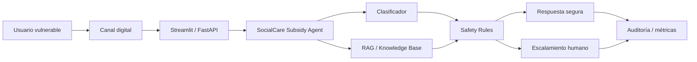

# SocialCare Subsidy Agent

SocialCare Subsidy Agent is a professional prototype of an AI agent for social-impact orientation. It helps users ask general questions about unemployment subsidy guidance, family support, services related to children, attention channels, required documents, and human escalation.

This project is inspired by my experience working in a social-purpose organization and uses simulated scenarios only, without exposing confidential company data or real user information.

## Social problem

Vulnerable users often face uncertainty when they need guidance about social benefits or family services. They may not know what documents to prepare, which channels are official, or when a case needs urgent human support.

## Proposed solution

The agent provides safe first-level orientation in clear Spanish, retrieves controlled simulated knowledge through RAG, classifies case risk, applies Responsible AI guardrails, and generates a safe summary for human advisors when needed.

## Capabilities shown

- AI agents
- Azure AI Foundry readiness
- RAG
- Responsible AI
- Enterprise architecture
- Social impact
- Secure escalation
- DevOps
- Python
- API design
- Observability
- GitFlow

## Architecture



## Local installation

```bash
python -m venv .venv
.venv\Scripts\activate
pip install -r requirements.txt
```

## Environment variables

Copy `.env.example` to `.env` for local execution and fill only the values you need. Do not commit `.env`.

Key variables:

- `AZURE_OPENAI_ENDPOINT`
- `AZURE_OPENAI_DEPLOYMENT`
- `AZURE_OPENAI_API_VERSION`
- `AZURE_AI_SEARCH_ENDPOINT`
- `AZURE_AI_SEARCH_INDEX`
- `AZURE_AI_SEARCH_KEY`
- `FOUNDRY_PROJECT_ENDPOINT`
- `APPINSIGHTS_CONNECTION_STRING`
- `ENVIRONMENT`
- `USE_LOCAL_RAG`

## Run FastAPI

```bash
uvicorn app.api.main:app --reload
```

Open `http://127.0.0.1:8000/docs`.

## Run Streamlit

```bash
streamlit run app/ui/streamlit_app.py
```

Open `http://localhost:8501`.

## Run with Docker Compose

```bash
docker compose up --build
```

FastAPI runs on port `8000` and Streamlit runs on port `8501`.

## Tests and quality

```bash
ruff check .
pytest
python -m compileall app
```

## Azure / Foundry deployment readiness

The repository includes:

- `azure.yaml` for Azure Developer CLI compatibility.
- `infra/main.bicep` for Azure AI Search, Storage, Application Insights, Log Analytics, Container Apps, and managed identity.
- `docs/deployment_azure_foundry.md` for manual Foundry connection steps.

The implementation keeps a clean boundary for Microsoft Foundry Agent Service in `app/agent/orchestrator.py`. A production version should connect the Foundry Project Endpoint, model deployment, Azure AI Search index, agent instructions, tool connection, and managed identity after confirming the current SDK/API surface.

## Responsible AI and privacy

The agent:

- Does not approve subsidies.
- Does not deny benefits.
- Does not invent requirements.
- Does not request complete sensitive data.
- Does not replace official advice.
- Escalates sensitive or high-risk cases.
- Uses simulated knowledge only.
- Stores masked audit events in `data/audit/audit_log.jsonl`.

## Value for social-purpose organizations

The prototype demonstrates how an organization can combine AI agents, controlled knowledge, risk classification, human escalation, and observability to improve access to orientation while protecting users.

## Impact metrics

- Percentage of high-risk cases escalated.
- Number of sensitive-data requests blocked.
- Classification accuracy on simulated datasets.
- RAG groundedness against controlled knowledge.
- Time to first safe orientation.
- Human advisor workload triage rate.

## Disclaimer

This is not an official Colsubsidio project. It does not include confidential company data, internal systems, real user data, or official benefit rules. It is a simulated portfolio and hackathon prototype.
