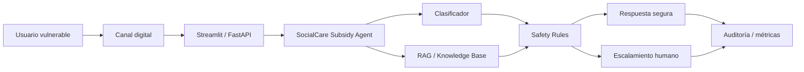

# Mermaid architecture

```mermaid
flowchart LR
    user[Usuario vulnerable] --> channel[Canal digital]
    channel --> app[Streamlit / FastAPI]
    app --> agent[SocialCare Subsidy Agent]
    agent --> classifier[Clasificador]
    agent --> rag[RAG / Knowledge Base]
    classifier --> safety[Safety Rules]
    rag --> safety
    safety --> response[Respuesta segura]
    safety --> handoff[Escalamiento humano]
    response --> audit[Auditoría / métricas]
    handoff --> audit
```
